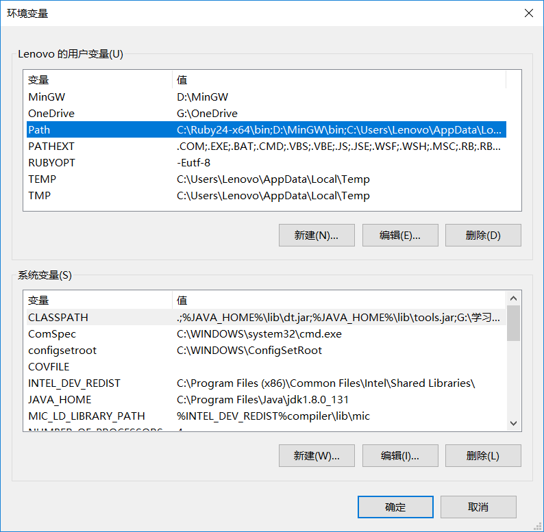
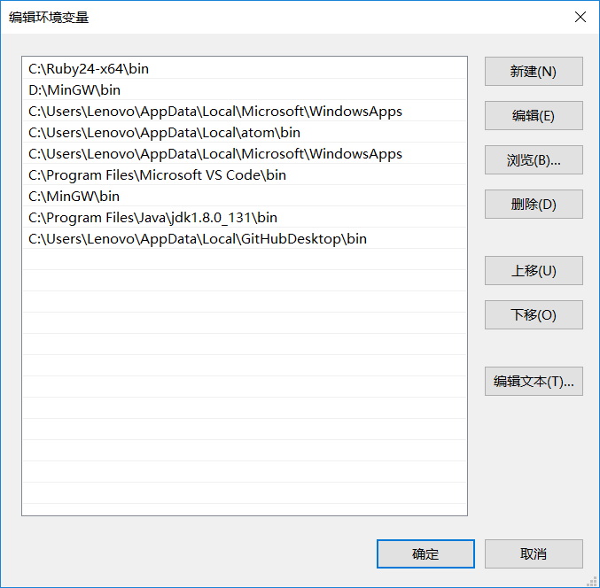

## 一. 安装 Atom 编辑器及 Teletype 插件
1. **安装 Atom 编辑器：**
Atom 官方下载地址：https://atom.io/
2. **安装 Teletype 插件：**
（ Teletype是什么？详情见官网：https://teletype.atom.io/ ）
在 Atom 安装完成后，打开 Atom，点击主界面右边的 ```Install a Package```，再点击```Open Installer```，搜索```Teletype```，安装 Teletype 插件。

3. **注册 Github 账号：**
Github 官网:https://github.com/
4. **将 Teletype 插件与 Github 账号绑定：**
在 Atom 中新建一个文件并保存为```HelloWorld.c```。
然后，点击如图右下角的按钮，


将弹出 Teletype 的设置小窗，点击提示中的链接，进入 Github 网站，使用你的 Github账号 进行授权，得到一串符号，复制后返回 Atom, 粘贴在刚刚离开时的地方。
5. **与队友连接**
在你和你的队友都完成了以上操作之后，点击```Share```, 你将得到一串符号，将这串符号发送给你的队友。让你的队友点击```Join a portal```，粘贴你发送给的他的字符串。此时，如果不出意外，你和你的队友应该已经连接成功，他的电脑上会出现你刚刚新建的文件，你们可以同时编辑这个文件，可以看到对方编辑的全过程，所有编辑在两人电脑中都实时同步。

## 二. 安装 gcc, 实现命令行编译源文件
因为 Atom 只是一个编辑器，和记事本差不多，只能编辑代码，不能编译运行代码。所以我们需要下载 c 语言的编译器，目前使用最广泛的是 MINGW gcc 编译器。
### （一）Windows 实现
1. **下载 gcc:**
官网地址: http://www.mingw.org/
进入网站后点击右上角的```Download Installer```即可下载。
2. **安装 gcc:**
打开下载的好的```mingw-get-setup.exe```，开始安装（需保持联网），建议默认方式安装即可。
安装完成后点击```Continue```，打开 MinGW Installation Manager, 找到```mingw32-gcc-g++```（注意```class```属性要为```bin```），右键点击```Mark for Installation```。
然后点击左上角的```Installation```菜单中的```Apply changes```选项，然后管理器将开始在线安装或更新被选中的组件。
3. **配置环境变量**
打开 控制面板 -> 系统和安全-> 系统 -> 高级系统设置 -> 高级 -> 环境变量



在用户变量中找到 PATH 并选中，点击```编辑```。



点击```新建```，输入```C:\MinGW\bin```。
如果安装时选择的路径不是默认路径，则填写自己选则的目录，但一定要定位到bin文件夹。
4. **重启电脑**
5. **测试是否安装成功**
在Windows开始菜单打开“命令提示符”（快速打开方式：按```Win```+```R```，输入```cmd```，回车）。


输入```gcc -v```，若出现和下图类似的版本信息，则说明环境配置成功。


假如我的```HelloWorld.c```文件的路径是：
```C:\Users\Lenovo\code\HelloWorld.c```，那么先输入```cd code```，进入```C:\Users\Lenovo```的子目录```code```，下面就可以在```code```目录下进行操作了。
输入命令```gcc HelloWorld.c -o HelloWorld```，即可完成对```HelloWorld.c```的编译，并在当前目录下生成```HelloWorld```可执行程序。
然后输入```HelloWorld```即可运行刚刚编译生成的可执行程序。


### （二）macOS 实现
例如，```HelloWorld.c```文件在“用户”路径下，那么打开终端后，输入命令```gcc HelloWorld.c -o HelloWorld```，即可完成对```HelloWorld.c```的编译，并在当前目录下生成```HelloWorld```可执行程序。
然后输入```HelloWorld```即可运行刚刚编译生成的可执行程序。

### （三）Linux 实现
参考上面的 macOS实现方式。用 Linux 的还需要看教程吗。。
